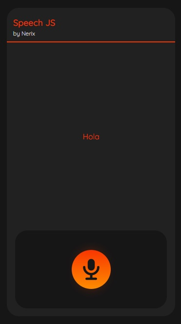

# Speech JS

## Proyecto que utiliza el reconocimiento de voz de JavaScript

Proyecto inspirado en el curso de Javascript de Juan Pablo de la torre Valdez en Udemy

### Curso:

[JavaScript Moderno Guía Definitiva](https://www.udemy.com/course/javascript-moderno-guia-definitiva-construye-10-proyectos/)
